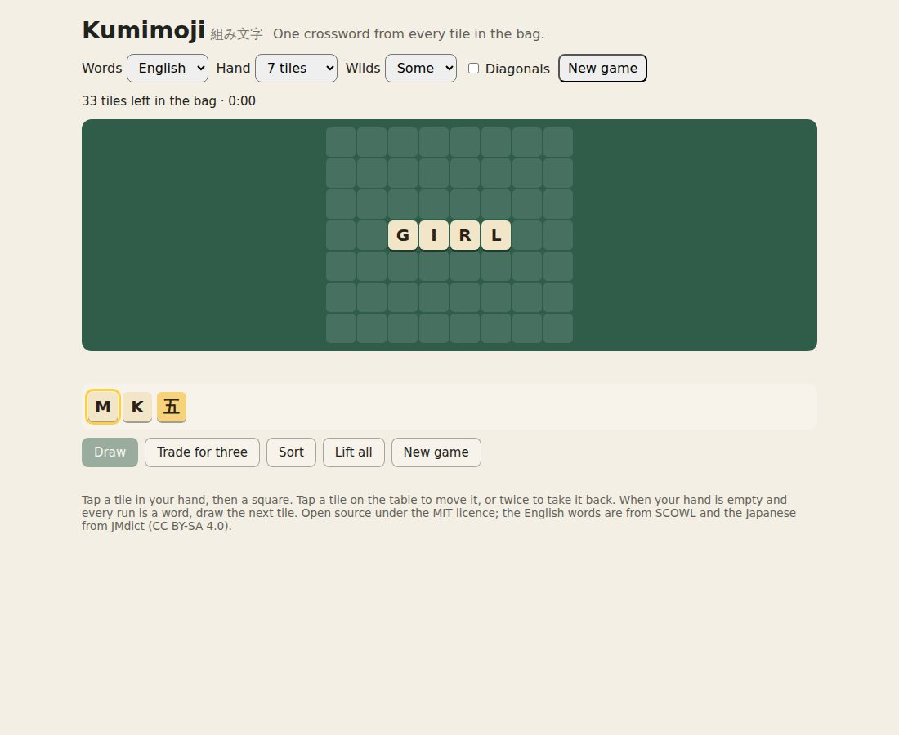
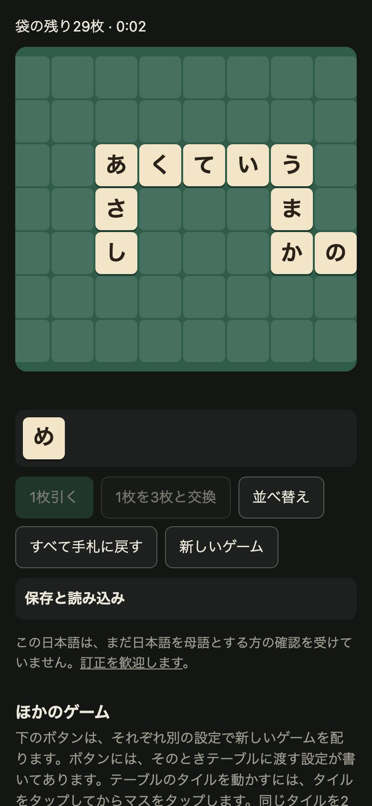

# Kumimoji 組み文字

[](https://github.com/johnmorrisdotca/kumimoji/actions/workflows/ci.yml)
[](https://www.npmjs.com/package/@johnmorrisdotca/kumimoji)
[](LICENSE)


**The crossword tile race, in English and Japanese, as pure and seeded TypeScript.**

Build one crossword from every tile in the bag. Lay your hand as words that
cross, and when your hand is empty and every run across and down is a word, draw
the next tile. A tile you cannot use can be traded for three. Use the last tile
in the bag and you are done. Play alone against the clock, or at a table of two
to eight sharing one bag, in English or in Japanese.

*Kumimoji* (組み文字) is "letters put together".

**[Play it](https://johnmorrisdotca.github.io/kumimoji/)**

<p>
  
  
</p>

- **Dealt from a seed.** `generateKumimoji` lays a crossword first and deals its
  tiles, so every bag can be finished, and two players racing the same seed get
  the same tiles in the same order.
- **English and Japanese.** 144 tiles in each: the English letter mix, or 45 base
  kana where が plays as か, ゃ as や and を as お. 110,316 English words and
  163,461 Japanese readings, from 2 to 15 tiles.
- **Wild tiles** that take any letter or kana, and are read as that letter in
  every word they are part of.
- **Diagonals**, if chosen: every diagonal run of three or more must be a word
  too.
- **The rules as plain functions.** A game in progress is a value
  (`TilePlay`): `deal`, `placeFromHand`, `moveOnTable`, `liftToHand`, `draw`,
  `trade` each return a new one. `judgeWithWords` says which runs are not words
  and which tiles are apart; `checkKumimoji` checks a finished grid against its
  bag, in time proportional to its size.
- **A table of two to eight** (`startParty`, `endTurn`, `drawAll`, `resign`,
  `joinParty`, `leaveParty`), kept as text (`encodeParty`, `decodeParty`), with a
  computer player that can take a seat (`planComputerTurn`).
- **A table to play on.** `mountKumimoji` plays a whole game alone in plain DOM;
  `KumimojiBoard` draws a grid in React.

It is the Kumimoji on [Itsutsu](https://itsutsu.com/games/kumimoji), which plays
alone, in races, round one device and across several with this package.

## How to play

1. Everyone starts with a hand of tiles from the bag: 3, 7 or 11.
2. Lay your tiles on the table as a crossword of your own. Every run of two or
   more tiles, across and down, must be a word, and every tile must join the
   one crossword. Move and take back tiles as often as you like.
3. When your hand is empty and the crossword is sound, draw the next tile. At a
   table, everyone draws together.
4. Stuck with a tile you cannot use? Trade it for three from the bag.
5. A wild tile is any letter or kana you give it, and reads as that in every
   word it is part of.
6. Near the end of the bag, a player who lays their last tile in a sound
   crossword goes out. Everyone else has one last turn to do the same, and all
   who go out win. Alone, you use every tile in the bag and race the clock.

## Install

```sh
pnpm add @johnmorrisdotca/kumimoji   # or: npm install @johnmorrisdotca/kumimoji
```

Or straight from a GitHub release, pinned to its version:

```sh
pnpm add https://github.com/johnmorrisdotca/kumimoji/releases/download/v1.0.0/johnmorrisdotca-kumimoji-1.0.0.tgz
```

ES modules with types, and no dependencies. The React components need React 18
or later.

## Play a game in code

```ts
import { deal, draw, generateKumimoji, judgeWithWords, loadTileWords, mayDraw, placeFromHand, squareAt } from "@johnmorrisdotca/kumimoji";

const words = await loadTileWords("english"); // fetched once, the first time
const dealt = generateKumimoji(7, "medium", 2026); // a hand of 7, some wilds, seed 2026
let play = deal(dealt.givens, 7);

play = placeFromHand(play, 0, squareAt(0, 0)); // the first tile of the hand, on row 0, column 0
const verdict = judgeWithWords(play.tiles, words);
if (mayDraw(play, verdict)) play = draw(play);
```

- `generateKumimoji(hand, level, seed, options?)`: a hand of 3, 7 or 11; a
  level of `"easy"`, `"medium"` or `"hard"` (more wild tiles, fewer, none);
  options `language`, `gameLength` (`"short"`, `"medium"`, or `"full"`, the
  whole set), `doubleSet` (two English sets) and `diagonals`. Returns the bag as
  `givens` and one finished grid as `solution`.
- A square is a string key, `squareAt(row, col)`; the grid has no edges.
- A tile is one character: an English letter, `*` for a wild with no letter, a
  capital for a wild given that letter (`assignHandTile`), and for Japanese a
  private-use character per kana (`tileFace` says what is printed on any tile).
- `isFinished(play, verdict)`: the hand empty, the bag empty, and every run a
  word in one piece.

### Checking a finished game

```ts
import { checkKumimoji, encodeGrid } from "@johnmorrisdotca/kumimoji";

checkKumimoji(7, dealt.givens, encodeGrid(play.tiles), { level: "medium" });
// { ok: true } or { ok: false, reason: "zqx is not in the word list" }
```

It checks that the grid uses exactly the tiles of the bag, is all one piece, and
that every run is a word. Nothing is searched, so a server can run it on every
game handed in.

### The word lists

In a browser, `loadTileWords(language)` fetches the list as its own module the
first time it is needed (about 600 KB for English, 700 KB for Japanese before
compression), so nothing else carries it. On a server, in a test or in a script,
import the `words` entry once, which reads the lists from this package's files:

```ts
import "@johnmorrisdotca/kumimoji/words";
```

`tileWords(language)` then hands back the loaded list: `allowed` (every word),
`byLength`, the tile `mix`, and the functions that turn tiles into words.

### A table of players

```ts
import { endTurn, handCanSpell, judgeWithWords, placeFromHand, seatPlay, squareAt, startParty, withSeatPlay } from "@johnmorrisdotca/kumimoji";

let game = startParty(
  { size: 7, level: "medium", seed: 1, gameLength: "short", language: "english", doubleSet: false, diagonals: false, hints: false },
  dealt.givens,
  ["Ann", { name: "Computer", computer: true }],
);
// The player to move plays their own hand and table as a TilePlay:
game = withSeatPlay(game, placeFromHand(seatPlay(game), 0, squareAt(0, 0)));
game = endTurn(game, judgeWithWords(seatPlay(game).tiles, words), (hand) => handCanSpell(hand, words));
```

`afterComputerTurn(game, words)` plays a computer seat's whole turn;
`planComputerTurn` lists its steps, for a page to show them one at a time.

## Play on a page

```html
<div id="table"></div>
<script type="module">
  import { mountKumimoji } from "@johnmorrisdotca/kumimoji/ui";
  mountKumimoji(document.getElementById("table"), {
    language: "english",
    hand: 7,
    onFinish: ({ elapsedMs }) => console.log(`Finished in ${elapsedMs / 1000}s`),
  });
</script>
```

Options: `language`, `hand`, `level`, `gameLength`, `diagonals`, `seed`,
`onFinish`. The handle has `play()`, `newGame(options?)` and `destroy()`.
Colours are CSS variables on `.km-root` (`--km-felt`, `--km-tile` and the
rest), light and dark.

### In React

```tsx
import { KumimojiBoard, KumimojiTable } from "@johnmorrisdotca/kumimoji/react";

<KumimojiBoard tiles={play.tiles} verdict={verdict} glyphOf={words.glyphOf} onSquare={(square) => press(square)} />
<KumimojiTable language="japanese" hand={7} />
```

## API at a glance

| Entry | What it holds |
| --- | --- |
| `@johnmorrisdotca/kumimoji` | Dealing: `generateKumimoji`, `KUMIMOJI_HANDS`; playing alone: `deal`, `placeFromHand`, `moveOnTable`, `swapWithHand`, `liftToHand`, `liftAll`, `sortHand`, `assignHandTile`, `draw`, `trade`, `mayDraw`, `mayTrade`, `isFinished`; judging: `judgeWithWords`, `runsOf`, `checkKumimoji`, `kumimojiPoints`; words: `loadTileWords`, `tileWords`, `wordsInHand`; a table: `startParty`, `endTurn`, `drawAll`, `resign`, `joinParty`, `leaveParty`, `encodeParty`, `decodeParty`; the computer: `planComputerTurn`, `afterComputerTurn`; views: `fitView`, `zoomView`, `panView`, `turnView`; and every type (`TilePlay`, `PartyGame`, `GridVerdict`, …). |
| `@johnmorrisdotca/kumimoji/words` | Loads both word lists from this package's files, for a server, a test or a script. |
| `@johnmorrisdotca/kumimoji/ui` | `mountKumimoji`, a whole game in plain DOM; `boardModel` for drawing a board yourself. |
| `@johnmorrisdotca/kumimoji/react` | `KumimojiBoard` and `KumimojiTable`. |

Every function is typed and documented in the source, and your editor shows the
documentation as you type.

## Browser support

Any browser that runs ES2022 modules: current Chrome, Edge, Firefox and Safari,
on a desk or a phone. The rules have no DOM in them and run the same in Node 20
or later, Deno, Bun and web workers. The table follows the system's light or
dark mode and needs nothing but a container element.

## Develop

```sh
pnpm install
pnpm test         # the rules, the lists, the table and the computer player
pnpm run build    # dist/
pnpm run site     # the demo in site/, as GitHub Pages serves it
```

## Roadmap

- More languages, each from a real dictionary of that language.
- Playing the plain-DOM table from a keyboard, as the React one can.
- A computer player at three strengths.
- Word definitions for a finished crossword.

## Contributing

Issues and pull requests are welcome. [CONTRIBUTING.md](CONTRIBUTING.md) says
how to set up, what the checks are and how a change is written up, and everyone
taking part follows the [code of conduct](CODE_OF_CONDUCT.md).

## Licence and notices

The code is MIT, © John Morris; see [LICENSE](LICENSE).

The word lists are other people's work, used under their own terms, and set out
in full in [NOTICE.md](NOTICE.md):

- **English**: from [SCOWL](http://wordlist.aspell.net/), © Kevin Atkinson and
  others, under a permissive licence whose notice travels with the lists.
- **Japanese**: readings derived from
  [JMdict](https://www.edrdg.org/jmdict/j_jmdict.html), © the Electronic
  Dictionary Research and Development Group, under
  [CC BY-SA 4.0](https://creativecommons.org/licenses/by-sa/4.0/). The
  Japanese list file (`src/words.ja.data.ts`) is shared under the same licence.
